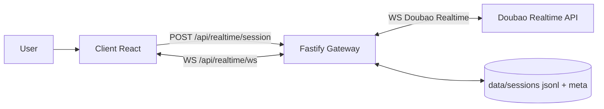
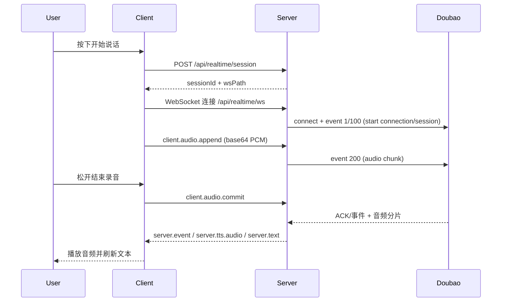

# voice-box_cx

本项目是一个本地运行的实时语音助手 Web 应用，默认走「豆包 Realtime API」实现按住说话、松开提交、边收边播的全双工体验。

- 前端（React + Vite）负责录音、播放、状态管理与打断交互
- 后端（Fastify + WebSocket）负责会话网关、协议转发与历史落盘
- 服务端通过 Doubao Realtime WebSocket 与上游建立长连接

## 功能概览

- 按住录音，松开发送（支持鼠标、触屏、空格/回车）
- 播报中再次按住可立即打断并开始新输入
- 自动管理 `sessionId`，支持连续多轮上下文
- 服务端可选落盘历史（`data/sessions/*.jsonl` + `*.meta.json`）
- 实时回传文本事件与音频分片，前端即时展示 transcript

## 技术架构



## 实时请求时序



## 项目结构

```text
.
├── client/
│   └── src/
│       ├── hooks/useRealtimeVoice.ts      # 实时语音状态机
│       ├── audio/realtimeRecorder.ts       # 录音与 16k PCM 下采样
│       ├── audio/realtimePlayer.ts         # 24k PCM 播放队列
│       └── components/                     # UI 组件
├── server/
│   └── src/
│       ├── routes/realtime.ts              # 实时会话 API + WS 网关
│       ├── services/doubaoRealtimeClient.ts# 上游 Doubao 客户端
│       ├── services/doubaoProtocol.ts      # 协议帧编解码
│       ├── routes/voice.ts                 # 旧版 OpenAI 单轮接口
│       └── services/historyStore.ts        # 会话历史存储
├── .env.example
└── package.json
```

## 运行要求

- Node.js `>= 20`
- 可用麦克风与扬声器（浏览器需授予权限）
- 豆包 Realtime 凭证（`DOUBAO_APP_ID`、`DOUBAO_ACCESS_KEY`）

## 快速开始

1. 安装依赖

```bash
npm install
```

2. 配置环境变量

```bash
cp .env.example .env
```

至少填写：

```bash
DOUBAO_APP_ID=your_app_id
DOUBAO_ACCESS_KEY=your_access_key
```

3. 启动开发环境

```bash
npm run dev
```

访问地址：

- Client: `http://127.0.0.1:5173`
- Server: `http://127.0.0.1:8787`

## 环境变量

服务端从根目录 `.env` 读取配置：

| 变量 | 默认值 | 说明 |
| --- | --- | --- |
| `DOUBAO_REALTIME_BASE_URL` | `wss://openspeech.bytedance.com/api/v3/realtime/dialogue` | Doubao Realtime 地址 |
| `DOUBAO_APP_ID` | 无 | 必填，应用 ID |
| `DOUBAO_ACCESS_KEY` | 无 | 必填，访问密钥 |
| `DOUBAO_RESOURCE_ID` | `volc.speech.dialog` | 资源 ID |
| `DOUBAO_APP_KEY` | `PlgvMymc7f3tQnJ6` | App Key |
| `DOUBAO_BOT_NAME` | `豆包` | 对话角色名 |
| `DOUBAO_SPEAKER` | `zh_male_yunzhou_jupiter_bigtts` | 默认发音人 |
| `DOUBAO_RECV_TIMEOUT` | `10` | 上游接收超时（10~120） |
| `DOUBAO_INPUT_MOD` | `audio` | 输入模式：`audio/text/audio_file` |
| `DOUBAO_INPUT_SAMPLE_RATE` | `16000` | 输入采样率（当前前端固定 16k） |
| `DOUBAO_OUTPUT_SAMPLE_RATE` | `24000` | 输出采样率 |
| `HOST` | `127.0.0.1` | 服务监听地址 |
| `PORT` | `8787` | 服务端口 |
| `SAVE_HISTORY` | `true` | 是否保存会话历史 |

兼容保留（旧版 `/api/voice/*` 使用）：

- `OPENAI_API_KEY`
- `OPENAI_BASE_URL`
- `OPENAI_STT_MODEL`
- `OPENAI_LLM_MODEL`
- `OPENAI_TTS_MODEL`
- `DEFAULT_VOICE`

## API 说明

### `GET /api/health`

健康检查。

### `POST /api/realtime/session`

创建实时会话。

请求体（可选）：

```json
{
  "speaker": "zh_male_yunzhou_jupiter_bigtts",
  "botName": "豆包",
  "recvTimeout": 10,
  "inputMod": "audio"
}
```

响应：

```json
{
  "sessionId": "uuid",
  "wsPath": "/api/realtime/ws?sessionId=uuid",
  "expiresAt": "2026-02-27T00:00:00.000Z"
}
```

### `GET /api/realtime/ws?sessionId=...`（WebSocket）

客户端消息：

- `client.start`
- `client.audio.append`（`audio`: base64 PCM）
- `client.audio.commit`
- `client.chat.text`
- `client.interrupt`
- `client.stop`

服务端消息：

- `server.ready`
- `server.tts.audio`（`audio`: base64 PCM）
- `server.text`
- `server.event`
- `server.error`
- `server.closed`

### `POST /api/realtime/interrupt`

主动中断某个实时会话。

请求体：

```json
{ "sessionId": "uuid" }
```

### 历史查询

- `GET /api/history`
- `GET /api/history/:sessionId`

### 兼容接口（旧版单轮）

- `POST /api/voice/turn`
- `POST /api/voice/interrupt`

## 会话与历史机制

- 首轮通过 `/api/realtime/session` 获取 `sessionId`
- 前端在一个会话内复用同一 `sessionId`
- 服务端记录关键事件（连接、音频分片、上游事件、中断、关闭）
- `SAVE_HISTORY=false` 时不落盘历史

## 排障建议

- 启动即报 `DOUBAO_APP_ID is required` 或 `DOUBAO_ACCESS_KEY is required`：检查 `.env`
- WebSocket 连接失败：检查企业网络策略、代理和防火墙
- 有文本无声音：确认浏览器自动播放策略与系统输出设备
- 频繁中断或超时：检查 `DOUBAO_RECV_TIMEOUT` 与网络抖动
