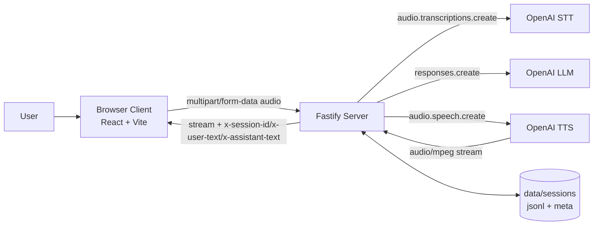
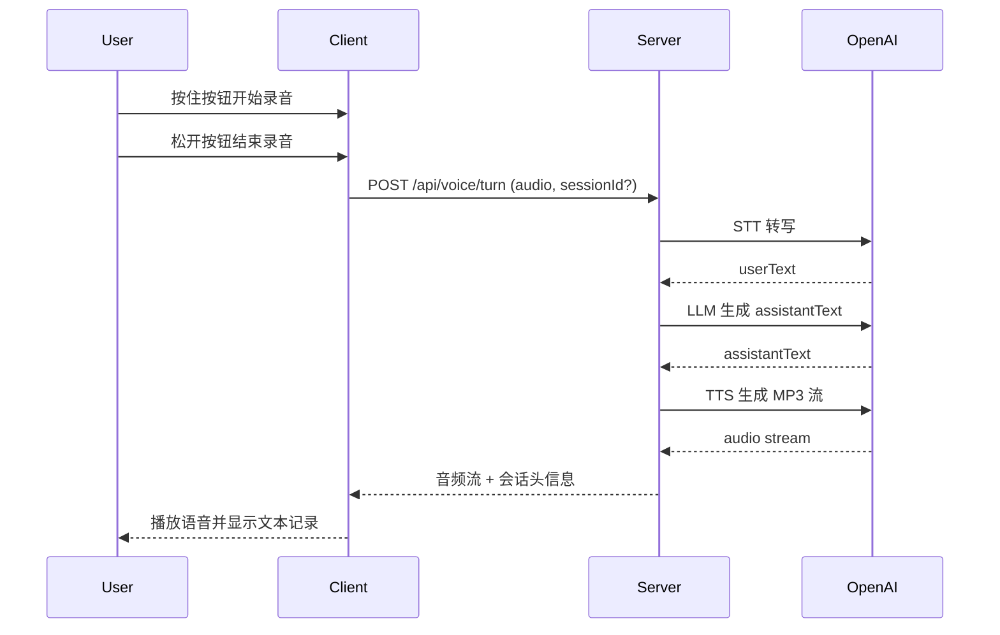

# voice-box_cx

本项目是一个本地运行的「按住说话」语音助手 Web 应用：

- 前端（React + Vite）负责录音、状态展示、音频播放与打断交互
- 后端（Fastify + OpenAI SDK）负责 STT、LLM、TTS 与会话历史
- OpenAI API Key 只保存在服务端，浏览器不直接持有密钥

核心链路：`浏览器录音 -> STT -> LLM -> TTS 音频流回放`

## 功能概览

- 按住录音，松开发送（支持鼠标、触屏、空格/回车）
- 正在播报时再次按住可立即打断当前轮次
- 自动管理 `sessionId`，支持连续多轮上下文
- 服务端可选落盘历史（`data/sessions/*.jsonl` + `*.meta.json`）
- 返回转写与回复摘要（通过响应头），前端即时显示对话记录

## 技术架构



## 请求时序（单轮对话）



## 项目结构

```text
.
├── client/                 # React 前端
│   └── src/
│       ├── hooks/useVoiceTurn.ts     # 录音/上传/播放/打断状态机
│       ├── audio/                     # 录音器与流式播放器
│       ├── components/                # UI 组件
│       └── styles/theme.css
├── server/                 # Fastify 服务
│   └── src/
│       ├── routes/                    # health/history/voice API
│       └── services/                  # env/openai/stt/llm/tts/historyStore
├── .env.example
└── package.json            # workspace 根脚本
```

## 运行要求

- Node.js `>= 20`
- 可用麦克风与扬声器（浏览器需授予权限）
- OpenAI API Key（需可访问 STT / Responses / TTS）

## 快速开始

1. 安装依赖

```bash
npm install
```

2. 配置环境变量

```bash
cp .env.example .env
```

至少设置：

```bash
OPENAI_API_KEY=sk-xxxx
```

3. 启动开发环境（前后端同时启动）

```bash
npm run dev
```

访问地址：

- Client: `http://127.0.0.1:5173`
- Server: `http://127.0.0.1:8787`

## 环境变量

服务端从根目录 `.env` 读取配置：

| 变量 | 默认值 | 说明 |
| --- | --- | --- |
| `OPENAI_API_KEY` | 无 | 必填，OpenAI API Key |
| `OPENAI_BASE_URL` | 空 | 可选，自定义兼容网关地址（如 `https://xxx/v1`） |
| `OPENAI_STT_MODEL` | `gpt-4o-mini-transcribe` | STT 模型 |
| `OPENAI_LLM_MODEL` | `gpt-4.1-mini` | 文本生成模型 |
| `OPENAI_TTS_MODEL` | `gpt-4o-mini-tts` | TTS 模型 |
| `DEFAULT_VOICE` | `marin` | 默认音色 |
| `HOST` | `127.0.0.1` | 服务监听地址 |
| `PORT` | `8787` | 服务端口 |
| `SAVE_HISTORY` | `true` | 是否保存会话历史（`false` 则不落盘） |

前端可选环境变量：

- `VITE_API_BASE_URL`：默认 `http://127.0.0.1:8787`

## 常用脚本

根目录：

- `npm run dev`：并行启动 client/server 开发服务
- `npm run build`：构建 client/server
- `npm run typecheck`：双端 TypeScript 类型检查

子项目：

- `npm run dev --workspace server`
- `npm run dev --workspace client`

## API 说明

### `GET /api/health`

健康检查。

示例响应：

```json
{
  "ok": true,
  "now": "2026-02-27T00:00:00.000Z"
}
```

### `POST /api/voice/turn`

处理一轮语音对话。

- Content-Type: `multipart/form-data`
- 必填字段：`audio`（文件）
- 可选字段：`sessionId`、`voice`、`languageHint`（`auto | zh | en`）

返回：

- Body：`audio/mpeg` 音频流
- Headers：
  - `x-session-id`
  - `x-user-text`（URL 编码，最多 500 字符）
  - `x-assistant-text`（URL 编码，最多 2000 字符）

### `POST /api/voice/interrupt`

主动打断服务端正在处理/播报中的轮次。

请求体：

```json
{ "sessionId": "xxx" }
```

### `GET /api/history`

列出会话元信息（最近更新在前）。

### `GET /api/history/:sessionId`

查询会话事件流（jsonl 解析结果）。

## 会话与历史机制

- `sessionId` 首轮可不传，由服务端生成并通过 `x-session-id` 返回
- 后续前端自动携带同一 `sessionId`，服务端读取历史 `turn_completed` 作为上下文
- 上下文窗口默认保留最近 12 轮（`historyStore.ts` 的 `DEFAULT_CONTEXT_TURNS`）
- 若 `SAVE_HISTORY=false`：
  - `/api/history` 返回空列表
  - `/api/history/:sessionId` 会返回 `404 session_not_found`

## 打断机制说明

- 前端再次按住时会：
  - 终止本地音频播放
  - 调用 `/api/voice/interrupt`
  - 进入新一轮录音
- 服务端对每个 `sessionId` 维护 in-flight `AbortController`：
  - 新请求到来会中止旧请求
  - 手动调用 interrupt 也会中止当前轮次

## 排障建议

- 启动即报 `OPENAI_API_KEY is required`：检查根目录 `.env`
- 浏览器无法录音：确认麦克风权限和 HTTPS/localhost 策略
- 播放失败或无声音：检查浏览器自动播放限制与系统输出设备
- API 报错 `voice_turn_failed`：查看 server 控制台日志（Fastify logger 已开启）
